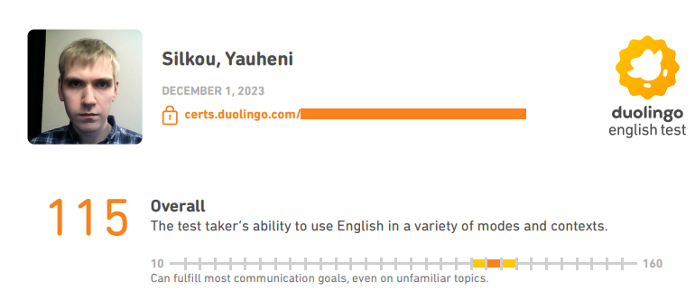

# Yauheni Silkou

---
## Contact Information

* **E-mail:** evgine279@gmail.com
* **Discord:** yauheni_silkou
* **Telegram:** yauheni_silkou

---
## Briefly About Myself

Reading books is my greatest hobby. Also, I am fond of psychology and reading special literature. It helps me gain confidence, self-development and understanding not only those around me, but also myself. I am fond of logic task solving. In my opinion there is a little discovery in independent solving of every such task.

I actively follow news in the IT sphere and have recently started studying AI technologies, driven by a strong desire to learn and explore new frontiers. Alongside this, I am learning to write fiction—novels, short stories—and occasionally practice it as a creative outlet.

I do moderate physical exercises for strong health and excellent well-being. Outlined as my primary characteristics are honesty, diligence, and friendliness.

---
## Skills

+ **Programming languages:** C#, JavaScript  
+ **UI technologies:** XAML, HTML, CSS  
+ **Desktop frameworks:** WinForms, WPF, Avalonia  
+ **Web frameworks:** ASP.NET Core  
+ **Architectural patterns:** MVC, MVVM, MVP  
+ **Architectures:** N-Layer, Hexagonal, Onion, Clean Architecture  
+ **Backend & APIs:** REST APIs, Dependency Injection  
+ **Database technologies:** SQLite, Microsoft SQL Server  
+ **ORM:** Entity Framework Core  
+ **Tools & technologies:** Git, Docker, Visual Studio

---
## Code Sample
### from Codewars

*Given an array of integers.*

*Return an array, where the first element is the count of positives numbers and the second element is sum of negative numbers. 0 is neither positive nor negative.*

*If the input is an empty array or is null, return an empty array.*

**Example**

*For input [1, 2, 3, 4, 5, 6, 7, 8, 9, 10, -11, -12, -13, -14, -15], you should return [10, -65].*

```C#
using System;
using System.Collections.Generic;
using System.Linq;

public class Kata
{
    public static int[] CountPositivesSumNegatives(int[] input)
    {
      int[] result;
      if (input is null || input.Length == 0)
      {
        result = new int[] {};
      }
      else
      {
        int pos = 0, neg = 0;
        for (int i = 0; i < input.Length; i++)
        {
          int x = input[i];
          if (x > 0)
          {
            pos++;
          }
          else if (x < 0)
          {
            neg += x;
          }
        }
        
        result = new int[2] {pos, neg};
      }
      
      return result;
    }
}
```

---
## Education

* **Master of Sciences in Engineering**

    **Specialized in:** System Analysis, Management and Information Processing

    Belarusian-Russian University (2017 - 2018)

    Master's Degree Diploma (Mogilev, June 28, 2018)

    *Master's thesis: "Development and Research of Technology for Increasing the Speed of Data Exchange in the Network Version of the Basic Simulation Model of the Production Activity of the Enterprise" (A) (60 pages).*

* **Information Technology Engineer**

    **Specialized in:** Automated Information Processing Systems

    Belarusian-Russian University (2012 - 2017)

    Diploma of Higher Education (Mogilev, June 30, 2017)

    *Graduation thesis: "Products Costing Automated Information Processing Systems of the “BELAZ” Opened Joint-Stock Company Branch - S. M. Kirov Mogilev Automobile Plant". (A)*

---
## Language Skills



+ **English:** B2 (Advanced Mid) (Duolingo English Test: Overall score 115)
+ **Belarusian:** C1 (Advanced)
+ **Russian:** C2 (Proficiency)